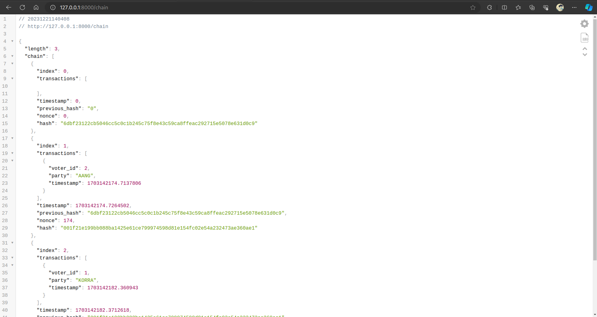

# VOTING SYSTEM USING BLOCKCHAIN

---

## Instructions to run the application

Clone the project,

```sh
git clone https://github.com/pat0nn/voting-system.git
```

Install the dependencies,

```sh
cd E-voting-system-using-blockchain-and-python
pip install -r requirements.txt
```

Start a blockchain node server,
```sh
python app.py
```
*or*
```sh
python3 app.py
```

One instance of our blockchain node is now up and running at port 8000.

You can change the port by changing the "port "variable in [here](./app.py#L15)

Here are a few screenshots

##### 1. Login


##### 2. Register


##### 3. Homepage


##### 4. Votepage


##### 5. Resutl (Admin only)


**Note**: You can change admin in [credentials.py](./credentials.py) file. Login with the admin account and go to the result page by adding the /adminPortal endpoint

##### 6. Chain



###### *If you get this error :*

 You just add endpoint /logout and reload, then everything will work normally again :)

***

To play around by spinning off multiple custom nodes, use the `register_with/` endpoint to register a new node. You can do this by clone project to another folder, change the port (such as 8001) and run 


Then you can use the following cURL requests to register the nodes at port 8001 with the already running 8000.
```
curl -X POST \
  http://127.0.0.1:8001/register_with \
  -H 'Content-Type: application/json' \
  -d '{"node_address": "http://127.0.0.1:8000"}'
```

This will make the node at port 8000 aware of the nodes at port 8001 and make the newer nodes sync the chain with the node 8000, so that they are able to actively participate in the mining process post registration.

Once you do all this, you can run the application, create transactions (post vote via the web inteface), and once you mine the transactions, all the nodes in the network will update the chain. The chain of the nodes can also be inspected by inovking `/chain` endpoint using cURL.

```sh
curl -X GET http://localhost:8001/chain
```
Use [JSON Viewer](https://chromewebstore.google.com/detail/json-viewer/gbmdgpbipfallnflgajpaliibnhdgobh) extension  to display the chain visually
## References
[BLOCKCHAIN-VOTING-SYSTEM](https://github.com/hariharan1412/BLOCKCHAIN-VOTING-SYSTEM.git)

[E-voting-system-using-blockchain-and-python](https://github.com/ramesh-adhikari/E-voting-system-using-blockchain-and-python)
