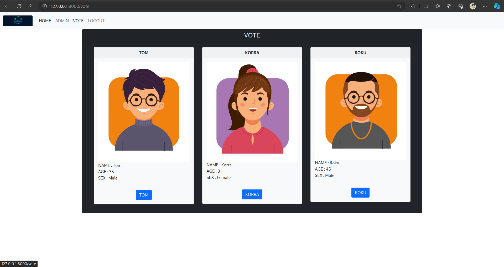

# VOTING SYSTEM USING BLOCKCHAIN

---

## Instructions to run the application

Clone the project,

```sh
$ git clone https://github.com/pat0nn/voting-system.git
```

Install the dependencies,

```sh
cd E-voting-system-using-blockchain-and-python
pip install -r requirements.txt
```

Start a blockchain node server,
```sh
python app.py
```
*or*
```sh
python3 app.py
```

One instance of our blockchain node is now up and running at port 8000.

You can change the port by changing the "port "variable in [here](./app.py#L15)

Here are a few screenshots

##### 1. Login


##### 2. Homepage


##### 3. Votepage



##### 4. Resutl (Admin only)


##### 5. Chain


To play around by spinning off multiple custom nodes, use the `register_with/` endpoint to register a new node. 

Here's a sample scenario that you might wanna try,

You can use the following cURL requests to register the nodes at port 8001 and 8002 with the already running 8000.
```
curl -X POST \
  http://127.0.0.1:8001/register_with \
  -H 'Content-Type: application/json' \
  -d '{"node_address": "http://127.0.0.1:8000"}'
```
```
curl -X POST \
  http://127.0.0.1:8002/register_with \
  -H 'Content-Type: application/json' \
  -d '{"node_address": "http://127.0.0.1:8000"}'
```

This will make the node at port 8000 aware of the nodes at port 8001 and 8002, and make the newer nodes sync the chain with the node 8000, so that they are able to actively participate in the mining process post registration.

To update the node with which the frontend application syncs (default is localhost port 8000), change `CONNECTED_SERVICE_ADDRESS` field in the [views.py](/app/views.py) file.

Once you do all this, you can run the application, create transactions (post vote via the web inteface), and once you mine the transactions, all the nodes in the network will update the chain. The chain of the nodes can also be inspected by inovking `/chain` endpoint using cURL.

```sh
$ curl -X GET http://localhost:8001/chain
$ curl -X GET http://localhost:8002/chain
```

## References
[BLOCKCHAIN-VOTING-SYSTEM](https://github.com/hariharan1412/BLOCKCHAIN-VOTING-SYSTEM.git)

[E-voting-system-using-blockchain-and-python](https://github.com/ramesh-adhikari/E-voting-system-using-blockchain-and-python)
